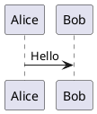
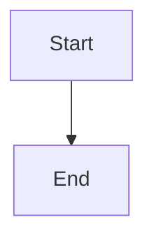

# Glance Help

Glance is a portable Markdown editor with a folder tree, tabbed editor, and rendered preview.

## Opening Folders

Use `File > Open Folder` to choose a folder. Glance scans the folder recursively and shows Markdown files in the left tree.

Supported file types:

- `.md`
- `.markdown`
- `.mdown`
- `.mkd`

Hidden files and folders are skipped by default.

## Opening Files

Open a file by double-clicking it in the file tree, or use `File > Open File`. If the file is already open, Glance switches to the existing tab.

You can also launch Glance with a folder or Markdown file path:

```text
glance /path/to/folder
glance /path/to/file.md
```

## Editing And Saving

Each Markdown file opens in its own tab. Modified files show an asterisk before the tab name.

Use:

- `File > Save File` to save the current tab.
- `File > Save All` to save all modified tabs.
- `File > Close Tab` to close the current tab.
- `Edit > Search and Replace` to find text, replace the current match, or replace all matches in the current tab.

When closing a modified tab, switching folders, or exiting the app, Glance asks whether to save changes.
Document editing, insertion, saving, closing, preview export, and printing commands are disabled when no document is open.

## Document Markdown Flavor

Use `Document > Settings` to choose the Markdown flavor for the current document. Glance uses `GitHub Markdown` by default and also supports `Vanilla Markdown`.

The selected flavor controls preview rendering, printing, preview HTML export, validation, and which Markdown formatting or insertion commands are available. Commands that do not apply to the current flavor are disabled.

Use `Document > Validate Markdown` to check the current document against its selected flavor.

## Preview

The right pane shows a rendered preview of the active Markdown tab. The preview updates automatically after a short debounce when you type.

In GitHub Markdown mode, the preview supports common Markdown structures:

- Headings
- Paragraphs
- Emphasis and strong text
- Strikethrough
- Subscript and superscript
- Lists and task lists
- Fenced code blocks and inline code
- PlantUML diagrams when the `plantuml` executable is available
- Mermaid diagrams when the `mmdc` or `mermaid` executable is available
- Blockquotes
- Tables
- Links and images
- Horizontal rules

Backslash escapes are honored for Markdown special characters, so escaped
syntax such as `\#`, `\*text\*`, `\[label\]\(target\)`, and `\- item`
renders as literal text instead of headings, emphasis, links, or lists. Escaped
spaces are preserved in the preview.

Vanilla Markdown mode supports the core Markdown subset without GitHub-specific extensions such as tables, task lists, strikethrough, subscript, and superscript.

Image paths are resolved relative to the Markdown file location when possible.

## Preview And Source Synchronization

The editor and the preview follow each other when `View > Follow Source` is
checked, which is the default. Uncheck it to stop the two panes tracking each
other.

- Clicking a block in the preview moves the editor caret to the Markdown line that produced it.
- Moving the caret in the editor highlights the matching block in the preview and scrolls it into view when it is off screen.

Synchronization requires the `wxWebView` preview engine. With the `wxHtmlWindow`
fallback the preview still renders, but it cannot follow the caret or report
clicks.

## Formatting Commands

Use the `Format` menu to transform selected text or insert placeholders at the caret.

Available commands include:

- Bold
- Italic
- Bold Italic
- Strikethrough
- Subscript
- Superscript
- Inline Code
- Code Block
- Blockquote
- Heading 1 through Heading 6
- Bullet List
- Numbered List
- Task List
- Completed Task
- Horizontal Rule
- Clear Formatting

Line-based commands operate on the current line or selected lines.
`Code Block` fences the selected lines, or inserts an empty block with a
selected placeholder when nothing is selected.
Some commands are disabled when the current document flavor does not define the required Markdown tag.

## Insert Commands

Use the `Insert` menu to add Markdown snippets:

- Link
- Image
- Table
- PlantUML Diagram
- Mermaid Diagram
- Bullet List
- Numbered List
- Task List
- Horizontal Rule
- Date
- Time
- Date and Time

The link command prompts for link text and URL. The image command prompts for an image file and alt text. Glance inserts a relative path when the image is near the current Markdown file. The table command asks how many columns to create.

PlantUML diagrams use fenced blocks such as:

````text

````

When PlantUML support is unavailable or the diagram source cannot be rendered,
the preview displays
`No PlantUML Support or error in PlantUML code` in a code box.

Mermaid diagrams use fenced blocks such as:

````text

````

When Mermaid support is unavailable or the diagram source cannot be rendered,
the preview displays
`No Mermaid Support or error in Mermaid code` in a code box.

If text is selected, inserted snippets are placed before the selected text instead of replacing it.

## Keyboard Shortcuts

| Shortcut | Action |
|---|---|
| `Ctrl+O` | Open File |
| `Ctrl+Shift+O` | Open Folder |
| `Ctrl+S` | Save File |
| `Ctrl+Shift+S` | Save All |
| `Ctrl+W` | Close Tab |
| `Ctrl+P` | Print |
| `Ctrl+Z` | Undo |
| `Ctrl+Y` | Redo |
| `Ctrl+X` | Cut |
| `Ctrl+C` | Copy |
| `Ctrl+V` | Paste |
| `Ctrl+A` | Select All |
| `Ctrl+H` | Search and Replace |
| `Ctrl+B` | Bold |
| `Ctrl+I` | Italic |
| `Ctrl+K` | Insert Link |
| `F1` | Help |

## Saving Preview HTML

Use `Help > Save Preview HTML` to save the raw HTML generated for the current preview.

This is useful for debugging rendering issues or exporting a lightweight preview document.

## Printing

Use `File > Print` to print the rendered Markdown preview for the current document flavor.

## Troubleshooting

If preview styling appears limited, your system may be using the `wxHtmlWindow` fallback. Installing the wxWidgets WebView development package enables a stronger HTML engine where available.

On Debian or Ubuntu, install:

```text
sudo apt install libwxgtk-webview3.2-dev
```

Then rerun CMake and rebuild the application.

If PlantUML diagrams do not appear in the preview, install `plantuml` so it
is on `PATH`, then restart Glance.

If Mermaid diagrams do not appear in the preview, install Mermaid CLI so
`mmdc` is on `PATH`, then restart Glance.
